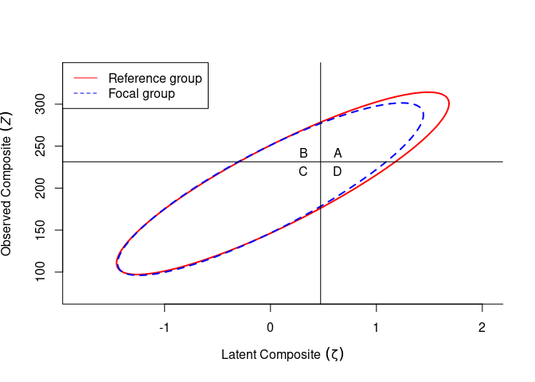
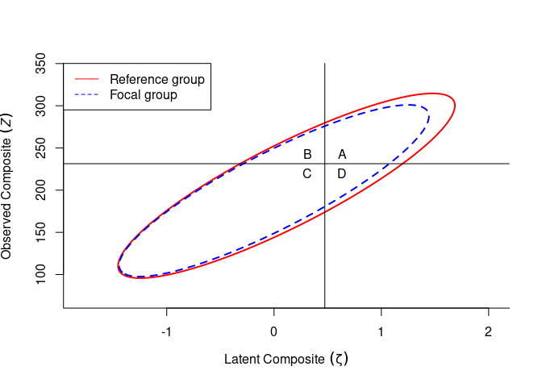

Illustrative Example
================

-   [Import data](#import-data)
-   [Specify the model](#specify-the-model)
-   [Step 1: Selection Parameters](#step-1-selection-parameters)
-   [Step 2: Selection Accuracy Under Strict
    Invariance](#step-2-selection-accuracy-under-strict-invariance)
-   [Step 3: Selection Accuracy Under Partial Strict
    Invariance](#step-3-selection-accuracy-under-partial-strict-invariance)
-   [Step 4: Compare the Change in Selection Accuracy
    indices](#step-4-compare-the-change-in-selection-accuracy-indices)
-   [Compare MCAA With Separate Unidimensional
    Analyses](#compare-mcaa-with-separate-unidimensional-analyses)
-   [Compare Partial Invariance With Dropping Noninvariant
    items](#compare-partial-invariance-with-dropping-noninvariant-items)
-   [Appendix: Parameter estimates for the partial strict invariance
    model](#appendix-parameter-estimates-for-the-partial-strict-invariance-model)

``` r
library(lavaan)
library(tidyverse)
library(knitr)
library(kableExtra)
library(broom)
```

``` r
# Load the provided code `PartInv_multi.R`
source(here::here("PartInv_multi.R"))
```

## Import data

The data are part of the supplemental materials by Oct et
al. (2020),[^1] and can be obtained at
<https://journals.sagepub.com/doi/suppl/10.1177/1073191119885018>

``` r
data <- read.table(here::here("IPIPFFM.dat"),
                   header = TRUE)
```

## Specify the model

Preliminary analysis showed eight pairs of unique factor covariances
need to be freed: A2 and A5, E4 and E7, I2 and I10, I8 and I9, A9 and
I9, C3 and E6, A2 and E7, E7 and N2.

``` r
model <- 'A =~  a2 + a5  + a7 + a9
          C =~  c3 + c4 + c8 + c9
          E =~ e1 + e4 + e6 + e7
          N =~ n1 + n2 + n6 + n8
          O =~ i2 + i8 + i9 + i10
          a2 ~~ a5
          e4 ~~ e7
          i2 ~~ i10
          i8 ~~ i9
          a9 ~~ i9
          c3 ~~ e6
          a2 ~~ e7
          e7 ~~ n2'
```

Conventional measurement invariance testing suggested the mini-IPIP
scale support partial strict invariance across gender. Specifically,
four items showed noninvariant intercepts across groups and three items
showed noninvariant unique factor variance across groups. The results
did not provide information on how these noninvariances may impact
personnel selection using the mini-IPIP, so we demonstrated the MCAA
framework in this example.

``` r
fit_strict <- cfa(model, data = data, group = "sex",
                  group.equal = c("loadings", "Intercepts", "residuals"),
                  group.partial = c("e6 ~ 1", "n1 ~ 1", "n2 ~ 1", "a2 ~ 1",
                                    "n2 ~~ n2", "n1 ~~ n1", "c8 ~~ c8"),
                  estimator = "MLR", std.lv = TRUE)
```

``` r
# Fit indices
knitr::kable(
  broom::glance(fit_strict) %>%
    select(AIC, BIC, cfi, chisq, npar, rmsea, srmr, tli, nobs),
  format = "markdown", 
  digits = 3
)
```

|      AIC |      BIC |   cfi |   chisq | npar | rmsea |  srmr |   tli | nobs |
|---------:|---------:|------:|--------:|-----:|------:|------:|------:|-----:|
| 31033.99 | 31523.85 | 0.949 | 464.056 |  113 | 0.035 | 0.057 | 0.945 |  564 |

``` r
# extract parameter estimates
result <- lavInspect(fit_strict, what = "est")
```

## Step 1: Selection Parameters

Because the population sizes for females and for males are roughly
equal, we used a mixing proportion(*π*<sub>*g*</sub>) of 0.5. The
weights for latent factors and items were calculated based on the
predictive validities reported by previous study (Drasgow et al., 2012).
The codes for obtaining the weights can be found in the supplementary
materials. For the selection cutoff, we assume that the mini-IPIP is
used to select the top 25% of the candidates.

## Step 2: Selection Accuracy Under Strict Invariance

To establish the baseline information of using the mini-IPIP for
selecting males and females, we first obtained the parameter estimates
under full strict invariance. The codes for extracting parameter
estimates from *lavaan* model object are provided in the supplementary
materials. Our function enables researchers to visualize and quantify
the impact of item bias on selection accuracy indices. From the table,
we can conclude female candidates would be selected in a slightly higher
proportion compared to male candidates if strict invariance holds.

``` r
strict <- PartInvMulti_we(propsel = .25,
             weights_item = c(3.1385, 3.1385, 3.1385, 3.1385,
                              8.3203, 8.3203, 8.3203, 8.3203,
                              5.1586, 5.1586, 5.1586, 5.1586,
                              -6.5870, -6.5870, -6.5870, -6.5870,
                              1.7957, 1.7957, 1.7957, 1.7957),
             # Agreeableness Conscientiousness Extraversion Neuroticism Openness
             weights_latent = c(0.1256, 0.3328, 0.2063, -0.2635, 0.0718),
             alpha_r = result[[2]]$alpha,
             alpha_f = result[[1]]$alpha,
             psi_r = result[[2]]$psi,
             psi_f = result[[1]]$psi,
             lambda_r = (result[[2]]$lambda + result[[1]]$lambda) / 2,
             nu_r = (result[[2]]$nu + result[[1]]$nu) / 2,
             Theta_r = (result[[2]]$theta + result[[1]]$theta) / 2)
```

<!-- -->

``` r
strict[1:5]
```

    ## $propsel
    ## [1] 0.25
    ## 
    ## $cutpt_xi
    ## [1] 0.4732752
    ## 
    ## $cutpt_z
    ## [1] 231.3604
    ## 
    ## $summary
    ##                     Reference Focal E_R.Focal.
    ## A (true positive)       0.217 0.153      0.217
    ## B (false positive)      0.064 0.066      0.064
    ## C (true negative)       0.647 0.723      0.647
    ## D (false negative)      0.072 0.058      0.072
    ## Proportion selected     0.281 0.219      0.281
    ## Success ratio           0.771 0.700      0.771
    ## Sensitivity             0.751 0.725      0.751
    ## Specificity             0.909 0.917      0.909
    ## 
    ## $ai_ratio
    ## [1] 1

## Step 3: Selection Accuracy Under Partial Strict Invariance

The selection accuracy of mini-IPIP under partial strict invariance can
be obtained in the same way as in Step 2, except that `nu_r` and `nu_f`
were different for males and for females, as well as `Theta_r` and
`Theta_f`. The column *E*\_*F*(Male) represents the expected proportion
selected for male candidates based on the latent score distributions of
the female candidates. The AI ratio for male candidates is estimated to
be 0.935, indicating a slight disadvantage for male candidates when
doing selection using the mini-IPIP.

``` r
par_strict <- PartInvMulti_we(propsel = .25,
              weights_item = c(3.1385, 3.1385, 3.1385, 3.1385,
                               8.3203, 8.3203, 8.3203, 8.3203,
                               5.1586, 5.1586, 5.1586, 5.1586,
                               -6.5870, -6.5870, -6.5870, -6.5870,
                               1.7957, 1.7957, 1.7957, 1.7957),
              # Agreeableness Conscientiousness Extraversion Neuroticism Openness
              weights_latent = c(0.1256, 0.3328, 0.2063, -0.2635, 0.0718),
              alpha_r = result[[2]]$alpha,
              alpha_f = result[[1]]$alpha,
              psi_r = result[[2]]$psi,
              psi_f = result[[1]]$psi,
              lambda_r = result[[2]]$lambda,
              nu_r = result[[2]]$nu,
              nu_f = result[[1]]$nu,
              Theta_r = result[[2]]$theta,
              Theta_f = result[[1]]$theta)
```

<!-- -->

``` r
par_strict[1:5]
```

    ## $propsel
    ## [1] 0.25
    ## 
    ## $cutpt_xi
    ## [1] 0.4732752
    ## 
    ## $cutpt_z
    ## [1] 231.3297
    ## 
    ## $summary
    ##                     Reference Focal E_R.Focal.
    ## A (true positive)       0.214 0.155      0.220
    ## B (false positive)      0.065 0.065      0.064
    ## C (true negative)       0.646 0.724      0.648
    ## D (false negative)      0.075 0.056      0.069
    ## Proportion selected     0.279 0.220      0.284
    ## Success ratio           0.766 0.706      0.775
    ## Sensitivity             0.741 0.736      0.761
    ## Specificity             0.908 0.918      0.910
    ## 
    ## $ai_ratio
    ## [1] 1.015058

## Step 4: Compare the Change in Selection Accuracy indices

Comparing the results in Steps 2 and 3, researchers can quantify the
impact of item bias on selection accuracy indices. In this example, we
see in the presence of item bias, male candidates are selected in a
lower proportion compared to when strict invariance holds (24.0% as
opposed to 24.8%), whereas female candidates are selected in a higher
proportion compared to when strict invariance holds (26.0% as opposed to
25.2%).

|                     | Female |  Male | *E*<sub>*F*</sub>(Male) | Female |  Male | *E*<sub>*F*</sub>(Male) |
|:--------------------|-------:|------:|------------------------:|-------:|------:|------------------------:|
| Proportion selected |  0.281 | 0.219 |                   0.281 |  0.279 | 0.220 |                   0.284 |
| Success ratio       |  0.771 | 0.700 |                   0.771 |  0.766 | 0.706 |                   0.775 |
| Sensitivity         |  0.751 | 0.725 |                   0.751 |  0.741 | 0.736 |                   0.761 |
| Specificity         |  0.909 | 0.917 |                   0.909 |  0.908 | 0.918 |                   0.910 |

Impact of Item Bias on Selection Accuracy Indices

Note: The column *E*<sub>*F*</sub>(Male) shows the expected proportion
for male candidates if the latent distributions are the same for both
genders.

## Compare MCAA With Separate Unidimensional Analyses

## Compare Partial Invariance With Dropping Noninvariant items

Sometimes researchers may want to remove the noninvariant items in the
selection criteria. While this removes item biases, it may result in
less effective classification due to reduced test length and thus
decreased reliability. To illustrate this, we rerun MCAA without the
items that showed noninvariance across genders (i.e., A2, C8, E6, N1,
and N2). The table below shows

``` r
# Try removing noninvariant items (A2, )
model_reduced <- "A =~  a5 + a7 + a9
                  C =~  c3 + c4 + c9
                  E =~ e1 + e4 + e7
                  N =~ ln * n6 + ln * n8
                  O =~ i2 + i8 + i9 + i10
                  e4 ~~ e7
                  i2 ~~ i10
                  i8 ~~ i9
                  a9 ~~ i9"
fit_reduced <- cfa(model_reduced,
  data = data, group = "sex",
  group.equal = c("loadings", "Intercepts", "residuals"),
  estimator = "MLR", std.lv = TRUE
)
pars_reduced <- lavInspect(fit_reduced, what = "est")
reduced <- PartInvMulti_we(
  propsel = .25,
  weights_item = c(c(3.1385, 3.1385, 3.1385) * 4 / 3,
                   c(8.3203, 8.3203, 8.3203) * 4 / 3,
                   c(5.1586, 5.1586, 5.1586) * 4 / 3,
                   c(-6.5870, -6.5870) * 4 / 2,
                   1.7957, 1.7957, 1.7957, 1.7957),
  weights_latent = c(0.1256, 0.3328, 0.2063, -0.2635, 0.0718),
  alpha_r = pars_reduced[[2]]$alpha,
  alpha_f = pars_reduced[[1]]$alpha,
  psi_r = pars_reduced[[2]]$psi,
  psi_f = pars_reduced[[1]]$psi,
  lambda_r = pars_reduced[[1]]$lambda,
  nu_r = pars_reduced[[1]]$nu,
  Theta_r = pars_reduced[[1]]$theta
)
```

<!-- -->

The table below shows lower selection accuracy with 15 invariant items
for both groups, compared to 20 items with the five biased items.

|                     | Female |  Male | *E*<sub>*F*</sub>(Male) |
|:--------------------|-------:|------:|------------------------:|
| Proportion selected |  0.279 | 0.221 |                   0.279 |
| Success ratio       |  0.724 | 0.669 |                   0.724 |
| Sensitivity         |  0.710 | 0.686 |                   0.710 |
| Specificity         |  0.892 | 0.907 |                   0.892 |

Impact of Item Bias on Selection Accuracy Indices

## Appendix: Parameter estimates for the partial strict invariance model

``` r
# Show parameter estimates
parameterEstimates(fit_strict)
```

    ##     lhs op rhs block group label    est    se       z pvalue ci.lower ci.upper
    ## 1     A =~  a2     1     1  .p1.  0.322 0.055   5.878  0.000    0.215    0.429
    ## 2     A =~  a5     1     1  .p2.  0.655 0.060  10.841  0.000    0.537    0.773
    ## 3     A =~  a7     1     1  .p3.  0.645 0.054  11.912  0.000    0.539    0.751
    ## 4     A =~  a9     1     1  .p4.  0.745 0.056  13.284  0.000    0.636    0.855
    ## 5     C =~  c3     1     1  .p5.  0.570 0.052  10.947  0.000    0.468    0.672
    ## 6     C =~  c4     1     1  .p6.  0.341 0.049   7.037  0.000    0.246    0.436
    ## 7     C =~  c8     1     1  .p7.  0.398 0.049   8.100  0.000    0.301    0.494
    ## 8     C =~  c9     1     1  .p8.  0.745 0.081   9.170  0.000    0.586    0.905
    ## 9     E =~  e1     1     1  .p9.  0.657 0.050  13.147  0.000    0.559    0.755
    ## 10    E =~  e4     1     1 .p10.  0.803 0.069  11.594  0.000    0.667    0.939
    ## 11    E =~  e6     1     1 .p11.  0.799 0.062  12.841  0.000    0.677    0.920
    ## 12    E =~  e7     1     1 .p12.  0.686 0.062  10.993  0.000    0.564    0.808
    ## 13    N =~  n1     1     1 .p13.  0.507 0.057   8.964  0.000    0.396    0.618
    ## 14    N =~  n2     1     1 .p14.  0.824 0.063  13.080  0.000    0.701    0.948
    ## 15    N =~  n6     1     1 .p15.  0.600 0.053  11.245  0.000    0.495    0.704
    ## 16    N =~  n8     1     1 .p16.  0.825 0.064  12.803  0.000    0.699    0.952
    ## 17    O =~  i2     1     1 .p17.  0.512 0.081   6.356  0.000    0.354    0.670
    ## 18    O =~  i8     1     1 .p18.  0.425 0.080   5.344  0.000    0.269    0.581
    ## 19    O =~  i9     1     1 .p19.  0.485 0.075   6.457  0.000    0.338    0.632
    ## 20    O =~ i10     1     1 .p20.  0.570 0.091   6.273  0.000    0.392    0.748
    ## 21   a2 ~~  a5     1     1        0.172 0.041   4.221  0.000    0.092    0.252
    ## 22   e4 ~~  e7     1     1       -0.107 0.078  -1.379  0.168   -0.259    0.045
    ## 23   i2 ~~ i10     1     1        0.312 0.089   3.521  0.000    0.138    0.486
    ## 24   i8 ~~  i9     1     1        0.457 0.098   4.653  0.000    0.265    0.650
    ## 25   a9 ~~  i9     1     1        0.149 0.047   3.145  0.002    0.056    0.242
    ## 26   c3 ~~  e6     1     1       -0.232 0.074  -3.136  0.002   -0.377   -0.087
    ## 27   a2 ~~  e7     1     1        0.012 0.045   0.269  0.788   -0.076    0.100
    ## 28   e7 ~~  n2     1     1       -0.023 0.050  -0.451  0.652   -0.121    0.076
    ## 29   a2 ~~  a2     1     1 .p29.  0.544 0.050  10.946  0.000    0.447    0.641
    ## 30   a5 ~~  a5     1     1 .p30.  0.536 0.055   9.759  0.000    0.429    0.644
    ## 31   a7 ~~  a7     1     1 .p31.  0.410 0.053   7.704  0.000    0.306    0.515
    ## 32   a9 ~~  a9     1     1 .p32.  0.356 0.054   6.611  0.000    0.251    0.462
    ## 33   c3 ~~  c3     1     1 .p33.  0.935 0.074  12.559  0.000    0.789    1.081
    ## 34   c4 ~~  c4     1     1 .p34.  0.410 0.039  10.578  0.000    0.334    0.486
    ## 35   c8 ~~  c8     1     1        0.495 0.064   7.756  0.000    0.370    0.620
    ## 36   c9 ~~  c9     1     1 .p36.  0.925 0.115   8.019  0.000    0.699    1.151
    ## 37   e1 ~~  e1     1     1 .p37.  0.784 0.058  13.555  0.000    0.671    0.898
    ## 38   e4 ~~  e4     1     1 .p38.  0.991 0.090  11.035  0.000    0.815    1.168
    ## 39   e6 ~~  e6     1     1 .p39.  0.881 0.073  12.136  0.000    0.739    1.023
    ## 40   e7 ~~  e7     1     1 .p40.  0.612 0.069   8.919  0.000    0.477    0.746
    ## 41   n1 ~~  n1     1     1        0.663 0.083   7.966  0.000    0.500    0.826
    ## 42   n2 ~~  n2     1     1        0.570 0.092   6.221  0.000    0.390    0.749
    ## 43   n6 ~~  n6     1     1 .p43.  0.748 0.059  12.641  0.000    0.632    0.864
    ## 44   n8 ~~  n8     1     1 .p44.  0.652 0.075   8.691  0.000    0.505    0.799
    ## 45   i2 ~~  i2     1     1 .p45.  0.735 0.090   8.123  0.000    0.558    0.912
    ## 46   i8 ~~  i8     1     1 .p46.  1.182 0.094  12.529  0.000    0.997    1.367
    ## 47   i9 ~~  i9     1     1 .p47.  1.015 0.090  11.268  0.000    0.839    1.192
    ## 48  i10 ~~ i10     1     1 .p48.  0.786 0.122   6.449  0.000    0.547    1.024
    ## 49    A ~~   A     1     1        1.000 0.000      NA     NA    1.000    1.000
    ## 50    C ~~   C     1     1        1.000 0.000      NA     NA    1.000    1.000
    ## 51    E ~~   E     1     1        1.000 0.000      NA     NA    1.000    1.000
    ## 52    N ~~   N     1     1        1.000 0.000      NA     NA    1.000    1.000
    ## 53    O ~~   O     1     1        1.000 0.000      NA     NA    1.000    1.000
    ## 54    A ~~   C     1     1        0.031 0.098   0.313  0.754   -0.162    0.223
    ## 55    A ~~   E     1     1        0.398 0.091   4.383  0.000    0.220    0.576
    ## 56    A ~~   N     1     1       -0.191 0.097  -1.960  0.050   -0.381    0.000
    ## 57    A ~~   O     1     1        0.416 0.113   3.676  0.000    0.194    0.638
    ## 58    C ~~   E     1     1        0.052 0.106   0.485  0.627   -0.157    0.260
    ## 59    C ~~   N     1     1       -0.159 0.104  -1.523  0.128   -0.364    0.046
    ## 60    C ~~   O     1     1       -0.009 0.134  -0.070  0.944   -0.272    0.253
    ## 61    E ~~   N     1     1       -0.041 0.101  -0.405  0.685   -0.239    0.157
    ## 62    E ~~   O     1     1        0.672 0.103   6.503  0.000    0.470    0.875
    ## 63    N ~~   O     1     1       -0.059 0.129  -0.458  0.647   -0.311    0.194
    ## 64   a2 ~1         1     1        3.944 0.056  70.735  0.000    3.835    4.054
    ## 65   a5 ~1         1     1 .p65.  3.562 0.062  57.403  0.000    3.440    3.684
    ## 66   a7 ~1         1     1 .p66.  3.999 0.055  72.486  0.000    3.891    4.107
    ## 67   a9 ~1         1     1 .p67.  3.618 0.059  61.186  0.000    3.503    3.734
    ## 68   c3 ~1         1     1 .p68.  3.287 0.059  56.183  0.000    3.173    3.402
    ## 69   c4 ~1         1     1 .p69.  4.263 0.039 109.524  0.000    4.187    4.339
    ## 70   c8 ~1         1     1 .p70.  4.181 0.044  94.704  0.000    4.095    4.268
    ## 71   c9 ~1         1     1 .p71.  3.599 0.071  50.883  0.000    3.461    3.738
    ## 72   e1 ~1         1     1 .p72.  2.270 0.060  38.013  0.000    2.153    2.387
    ## 73   e4 ~1         1     1 .p73.  2.924 0.071  41.218  0.000    2.785    3.063
    ## 74   e6 ~1         1     1        3.012 0.078  38.552  0.000    2.859    3.165
    ## 75   e7 ~1         1     1 .p75.  3.091 0.061  50.674  0.000    2.971    3.210
    ## 76   n1 ~1         1     1        2.259 0.062  36.249  0.000    2.137    2.382
    ## 77   n2 ~1         1     1        2.460 0.072  33.974  0.000    2.318    2.602
    ## 78   n6 ~1         1     1 .p78.  2.324 0.058  39.856  0.000    2.209    2.438
    ## 79   n8 ~1         1     1 .p79.  2.279 0.071  31.976  0.000    2.139    2.418
    ## 80   i2 ~1         1     1 .p80.  3.972 0.055  72.365  0.000    3.864    4.079
    ## 81   i8 ~1         1     1 .p81.  3.590 0.062  57.626  0.000    3.468    3.712
    ## 82   i9 ~1         1     1 .p82.  3.615 0.061  59.144  0.000    3.495    3.735
    ## 83  i10 ~1         1     1 .p83.  4.072 0.063  64.852  0.000    3.948    4.195
    ## 84    A ~1         1     1        0.000 0.000      NA     NA    0.000    0.000
    ## 85    C ~1         1     1        0.000 0.000      NA     NA    0.000    0.000
    ## 86    E ~1         1     1        0.000 0.000      NA     NA    0.000    0.000
    ## 87    N ~1         1     1        0.000 0.000      NA     NA    0.000    0.000
    ## 88    O ~1         1     1        0.000 0.000      NA     NA    0.000    0.000
    ## 89    A =~  a2     2     2  .p1.  0.322 0.055   5.878  0.000    0.215    0.429
    ## 90    A =~  a5     2     2  .p2.  0.655 0.060  10.841  0.000    0.537    0.773
    ## 91    A =~  a7     2     2  .p3.  0.645 0.054  11.912  0.000    0.539    0.751
    ## 92    A =~  a9     2     2  .p4.  0.745 0.056  13.284  0.000    0.636    0.855
    ## 93    C =~  c3     2     2  .p5.  0.570 0.052  10.947  0.000    0.468    0.672
    ## 94    C =~  c4     2     2  .p6.  0.341 0.049   7.037  0.000    0.246    0.436
    ## 95    C =~  c8     2     2  .p7.  0.398 0.049   8.100  0.000    0.301    0.494
    ## 96    C =~  c9     2     2  .p8.  0.745 0.081   9.170  0.000    0.586    0.905
    ## 97    E =~  e1     2     2  .p9.  0.657 0.050  13.147  0.000    0.559    0.755
    ## 98    E =~  e4     2     2 .p10.  0.803 0.069  11.594  0.000    0.667    0.939
    ## 99    E =~  e6     2     2 .p11.  0.799 0.062  12.841  0.000    0.677    0.920
    ## 100   E =~  e7     2     2 .p12.  0.686 0.062  10.993  0.000    0.564    0.808
    ## 101   N =~  n1     2     2 .p13.  0.507 0.057   8.964  0.000    0.396    0.618
    ## 102   N =~  n2     2     2 .p14.  0.824 0.063  13.080  0.000    0.701    0.948
    ## 103   N =~  n6     2     2 .p15.  0.600 0.053  11.245  0.000    0.495    0.704
    ## 104   N =~  n8     2     2 .p16.  0.825 0.064  12.803  0.000    0.699    0.952
    ## 105   O =~  i2     2     2 .p17.  0.512 0.081   6.356  0.000    0.354    0.670
    ## 106   O =~  i8     2     2 .p18.  0.425 0.080   5.344  0.000    0.269    0.581
    ## 107   O =~  i9     2     2 .p19.  0.485 0.075   6.457  0.000    0.338    0.632
    ## 108   O =~ i10     2     2 .p20.  0.570 0.091   6.273  0.000    0.392    0.748
    ## 109  a2 ~~  a5     2     2        0.099 0.041   2.396  0.017    0.018    0.180
    ## 110  e4 ~~  e7     2     2       -0.083 0.068  -1.219  0.223   -0.216    0.050
    ## 111  i2 ~~ i10     2     2        0.275 0.101   2.722  0.006    0.077    0.474
    ## 112  i8 ~~  i9     2     2        0.580 0.090   6.437  0.000    0.403    0.757
    ## 113  a9 ~~  i9     2     2       -0.006 0.037  -0.148  0.882   -0.078    0.067
    ## 114  c3 ~~  e6     2     2       -0.030 0.059  -0.506  0.613   -0.144    0.085
    ## 115  a2 ~~  e7     2     2       -0.116 0.039  -2.980  0.003   -0.191   -0.040
    ## 116  e7 ~~  n2     2     2       -0.146 0.053  -2.783  0.005   -0.249   -0.043
    ## 117  a2 ~~  a2     2     2 .p29.  0.544 0.050  10.946  0.000    0.447    0.641
    ## 118  a5 ~~  a5     2     2 .p30.  0.536 0.055   9.759  0.000    0.429    0.644
    ## 119  a7 ~~  a7     2     2 .p31.  0.410 0.053   7.704  0.000    0.306    0.515
    ## 120  a9 ~~  a9     2     2 .p32.  0.356 0.054   6.611  0.000    0.251    0.462
    ## 121  c3 ~~  c3     2     2 .p33.  0.935 0.074  12.559  0.000    0.789    1.081
    ## 122  c4 ~~  c4     2     2 .p34.  0.410 0.039  10.578  0.000    0.334    0.486
    ## 123  c8 ~~  c8     2     2        0.705 0.093   7.606  0.000    0.523    0.886
    ## 124  c9 ~~  c9     2     2 .p36.  0.925 0.115   8.019  0.000    0.699    1.151
    ## 125  e1 ~~  e1     2     2 .p37.  0.784 0.058  13.555  0.000    0.671    0.898
    ## 126  e4 ~~  e4     2     2 .p38.  0.991 0.090  11.035  0.000    0.815    1.168
    ## 127  e6 ~~  e6     2     2 .p39.  0.881 0.073  12.136  0.000    0.739    1.023
    ## 128  e7 ~~  e7     2     2 .p40.  0.612 0.069   8.919  0.000    0.477    0.746
    ## 129  n1 ~~  n1     2     2        0.944 0.078  12.028  0.000    0.790    1.097
    ## 130  n2 ~~  n2     2     2        0.959 0.116   8.259  0.000    0.731    1.186
    ## 131  n6 ~~  n6     2     2 .p43.  0.748 0.059  12.641  0.000    0.632    0.864
    ## 132  n8 ~~  n8     2     2 .p44.  0.652 0.075   8.691  0.000    0.505    0.799
    ## 133  i2 ~~  i2     2     2 .p45.  0.735 0.090   8.123  0.000    0.558    0.912
    ## 134  i8 ~~  i8     2     2 .p46.  1.182 0.094  12.529  0.000    0.997    1.367
    ## 135  i9 ~~  i9     2     2 .p47.  1.015 0.090  11.268  0.000    0.839    1.192
    ## 136 i10 ~~ i10     2     2 .p48.  0.786 0.122   6.449  0.000    0.547    1.024
    ## 137   A ~~   A     2     2        0.562 0.114   4.945  0.000    0.339    0.785
    ## 138   C ~~   C     2     2        1.455 0.251   5.797  0.000    0.963    1.947
    ## 139   E ~~   E     2     2        0.979 0.130   7.559  0.000    0.725    1.233
    ## 140   N ~~   N     2     2        1.114 0.167   6.657  0.000    0.786    1.442
    ## 141   O ~~   O     2     2        1.859 0.468   3.973  0.000    0.942    2.777
    ## 142   A ~~   C     2     2       -0.036 0.081  -0.443  0.658   -0.195    0.123
    ## 143   A ~~   E     2     2        0.135 0.065   2.093  0.036    0.009    0.262
    ## 144   A ~~   N     2     2       -0.159 0.078  -2.036  0.042   -0.313   -0.006
    ## 145   A ~~   O     2     2        0.294 0.109   2.703  0.007    0.081    0.507
    ## 146   C ~~   E     2     2        0.114 0.100   1.140  0.254   -0.082    0.311
    ## 147   C ~~   N     2     2       -0.310 0.118  -2.635  0.008   -0.541   -0.079
    ## 148   C ~~   O     2     2       -0.245 0.159  -1.538  0.124   -0.557    0.067
    ## 149   E ~~   N     2     2       -0.175 0.091  -1.929  0.054   -0.354    0.003
    ## 150   E ~~   O     2     2        0.455 0.137   3.308  0.001    0.185    0.724
    ## 151   N ~~   O     2     2       -0.055 0.131  -0.420  0.674   -0.311    0.201
    ## 152  a2 ~1         2     2        4.098 0.063  65.328  0.000    3.975    4.221
    ## 153  a5 ~1         2     2 .p65.  3.562 0.062  57.403  0.000    3.440    3.684
    ## 154  a7 ~1         2     2 .p66.  3.999 0.055  72.486  0.000    3.891    4.107
    ## 155  a9 ~1         2     2 .p67.  3.618 0.059  61.186  0.000    3.503    3.734
    ## 156  c3 ~1         2     2 .p68.  3.287 0.059  56.183  0.000    3.173    3.402
    ## 157  c4 ~1         2     2 .p69.  4.263 0.039 109.524  0.000    4.187    4.339
    ## 158  c8 ~1         2     2 .p70.  4.181 0.044  94.704  0.000    4.095    4.268
    ## 159  c9 ~1         2     2 .p71.  3.599 0.071  50.883  0.000    3.461    3.738
    ## 160  e1 ~1         2     2 .p72.  2.270 0.060  38.013  0.000    2.153    2.387
    ## 161  e4 ~1         2     2 .p73.  2.924 0.071  41.218  0.000    2.785    3.063
    ## 162  e6 ~1         2     2        3.428 0.089  38.528  0.000    3.253    3.602
    ## 163  e7 ~1         2     2 .p75.  3.091 0.061  50.674  0.000    2.971    3.210
    ## 164  n1 ~1         2     2        2.566 0.071  35.974  0.000    2.427    2.706
    ## 165  n2 ~1         2     2        2.699 0.094  28.652  0.000    2.515    2.884
    ## 166  n6 ~1         2     2 .p78.  2.324 0.058  39.856  0.000    2.209    2.438
    ## 167  n8 ~1         2     2 .p79.  2.279 0.071  31.976  0.000    2.139    2.418
    ## 168  i2 ~1         2     2 .p80.  3.972 0.055  72.365  0.000    3.864    4.079
    ## 169  i8 ~1         2     2 .p81.  3.590 0.062  57.626  0.000    3.468    3.712
    ## 170  i9 ~1         2     2 .p82.  3.615 0.061  59.144  0.000    3.495    3.735
    ## 171 i10 ~1         2     2 .p83.  4.072 0.063  64.852  0.000    3.948    4.195
    ## 172   A ~1         2     2        0.743 0.083   8.936  0.000    0.580    0.905
    ## 173   C ~1         2     2        0.140 0.115   1.219  0.223   -0.085    0.366
    ## 174   E ~1         2     2       -0.019 0.104  -0.186  0.853   -0.224    0.185
    ## 175   N ~1         2     2       -0.049 0.111  -0.444  0.657   -0.266    0.168
    ## 176   O ~1         2     2       -0.458 0.166  -2.764  0.006   -0.783   -0.133

[^1]: Ock, J., McAbee, S. T., Mulfinger, E., & Oswald, F. L. (2020). The
    practical effects of measurement invariance: Gender invariance in
    two Big Five personality measures. *Assessment, 27(4)*, 657-674.
    <https://doi.org/10.1177/1073191119885018>
